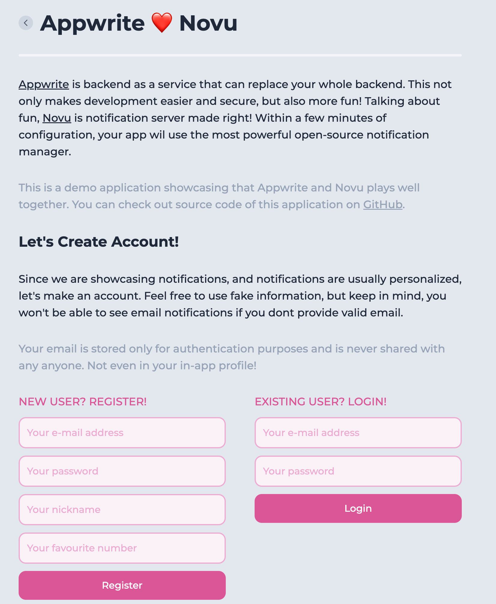
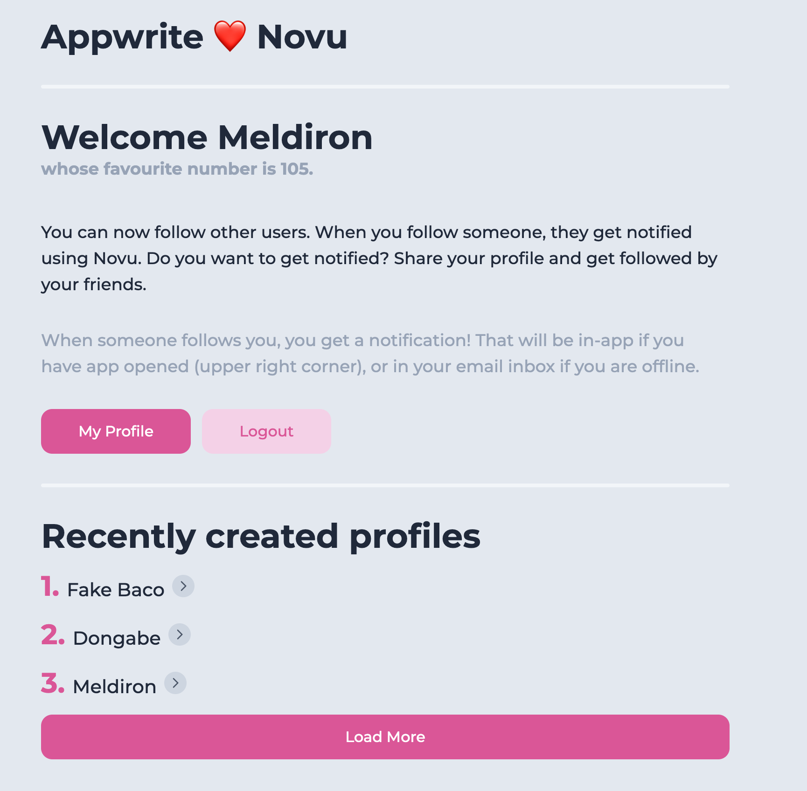
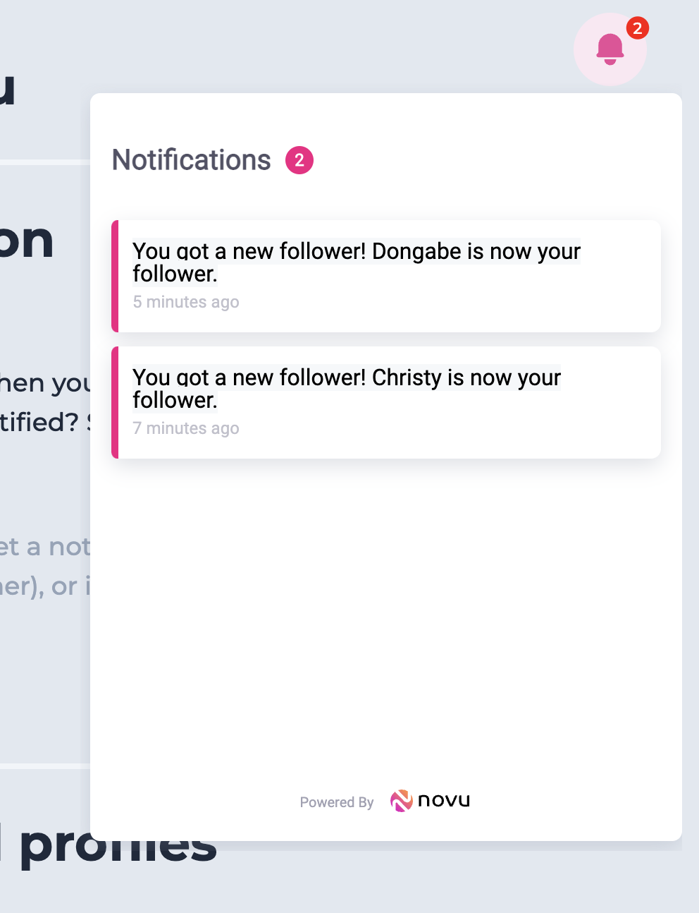
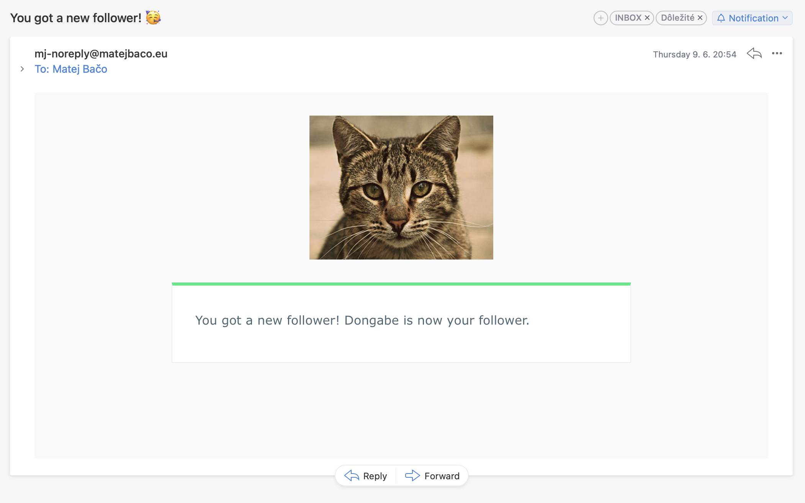

# 🔔 Appwrite ❤️ Novu

This is a demo application showcasing Appwrite backend-as-a-service working hand in hand with Novu notification server.

This demo app allows users to register and login. During registration, a simple profile is created. Once logged in, you can see list of all profiles, and follow them if you like them. When you follow a profile, a notification is sent using Novu.

## 🖼️ Pics, pics, pics!










## 🤖 Auto-generated README by Svelte (Kit)

Everything you need to build a Svelte project, powered by [`create-svelte`](https://github.com/sveltejs/kit/tree/master/packages/create-svelte).

## Creating a project

If you're seeing this, you've probably already done this step. Congrats!

```bash
# create a new project in the current directory
npm init svelte

# create a new project in my-app
npm init svelte my-app
```

## Developing

Once you've created a project and installed dependencies with `npm install` (or `pnpm install` or `yarn`), start a development server:

```bash
npm run dev

# or start the server and open the app in a new browser tab
npm run dev -- --open
```

## Building

To create a production version of your app:

```bash
npm run build
```

You can preview the production build with `npm run preview`.

> To deploy your app, you may need to install an [adapter](https://kit.svelte.dev/docs/adapters) for your target environment.
